# KikiCourier

"Kiki's Courier Services" is an online courier services application.

This application currently provides the following features:
1. Estimating the delivery cost and discounts for the given offer code.
2. Estimating the delivery time for each package.

#### Programming Language:
#### Kotlin

# Table of contents

- [Documentation](#Documentation)
  - [Classes and Functionalities](#Classes-and-Functionalities)
    - [com.twofaces.ui](#-comtwofacesui)
      - [KikiCourier.kt](#KikiCourierkt)
      - [FetchUserInput.kt](#FetchUserInputkt)
    - [com.twofaces.data](#-comtwofacesdata)
      - [Courier.kt](#Courierkt)
      - [OfferCodes.kt](#OfferCodeskt)
      - [Packages.kt](#Packageskt)
      - [Vehicles.kt](#Vehicleskt)
      - [PackageComp.kt](#PackageCompkt)
    - [com.twofaces.estimations](#-comtwofacesestimations)
      - [DeliveryCostEstimation.kt](#DeliveryCostEstimationkt)
      - [DeliveryTimeEstimation.kt](#DeliveryTimeEstimationkt)
    - [com.twofaces.util](#-comtwofacesutil)
      - [Format.kt](#Formatkt)
      - [Validations.kt](#Validationskt)
  - [Algorithm to calculate the optimal package group](#Algorithm-to-calculate-the-optimal-package-group)
  - [Unit tests](#Unit-tests)
- [How to start the application?](#How-to-start-the-application)
- [Sample Test Cases](#Sample-Test-Cases)

# Documentation

## Classes and Functionalities

### \> com.twofaces.ui

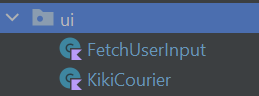

>### _KikiCourier.kt_

_Entry point of the application._

- **Fields / Properties**
  - _scan_ - Scanner object to take the user input from the command line.

- **Methods**
  - _startApplication()_ - Start the application (Entry point)
  - _displayFeatures()_ - Display all the available features in the application.
  - _estimateDeliveryCost()_ - Estimate the delivery cost for a list of packages.
  - _estimateDeliveryTime()_ - Estimate the delivery time (and cost) for a list of packages.
  - _printDeliveryDetails()_ - Print the details of the package after processing (cost/time estimation).

>### _FetchUserInput.kt_

_Fetches the user input._

- **Fields / Properties**
  - _baseDeliveryCost_ - Base delivery cost for each package.
  - _numberOfPackages_ - Total number of packages.
  - _validate_ - Object of **_Validate_** class

- **Methods**
  - _fetchBaseDeliveryDetails()_ - Fetch the base delivery details from the command-line input.
  - _fetchPackageDetails()_ - Fetch the package details from the command-line input.
  - _fetchVehicleDetails()_ - Fetch the vehicle details from the command-line input.

### \> com.twofaces.data

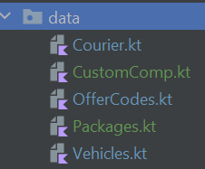

>### _Courier.kt_

_Has main courier details. All operations and details of core 'Courier Service' are present here_

- **Data Classes**
  - _**BaseDeliveryDetails**_
    - _baseDeliveryCost_ - Base delivery cost for each package.
    - _numberOfPackages_ - Total number of packages.

  

>### _OfferCodes.kt_

_Has offer code details. All operations and details related to 'Offer codes' are present here_

>**Note:**  
>Real-time applications usually use databases (backend) to store the offer codes but since this is a command-line application, offer codes are implemented as a list (of objects).

To add a new offer code, just add a new OfferCode() object in the list:

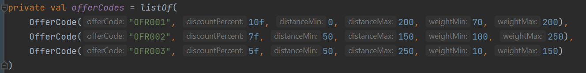

- **Data Classes**
  - _**OfferCode**_
    - _offerCode_ - Offer Code.
    - _discountPercent_ - Discount Percent.
    - _distanceMin_ - Minimum Distance to be valid.
    - _distanceMax_ - Maximum Distance to be valid.
    - _weightMin_ - Minimum Weight to be valid.
    - _weightMax_ - Maximum Weight to be valid.

- **Fields / Properties**
  - _offerCodes_ - A list of pre-defined _OfferCode_ objects

- **Methods**
  - _isValidOfferCode()_ - Checks if the entered offer code is valid
  - _getOfferCode()_ - Returns the _OfferCode_ object if the user inputted offer code matches any offer code in the pre-defined list 

>### _Packages.kt_

_Has package details. All operations and details related to the 'Package' are present here_

>#### Optimal Package Group
>1. Maximum number of packages that can be carried by the vehicle.
>2. If multiple combinations of the maximum number of packages occur, the heaviest package group should be preferred.
>3. If the total weights of the package group are also same, priority should be given to package group which can be delivered first.

- **Data Classes**
  - _**Package**_
    - _UID_ - Unique ID of the package (Integer).
    - _packageID_ - Package ID (String).
    - _packageWeight_ - Weight of the package.
    - _distance_ - Distance at which the package has to be delivered.
    - _offerCode_ - Offer code to be applied on the package.
    - _discount_ - Discount applied on the package using the provided offer code. 
    - _estimatedCost_ - Estimated cost to deliver the package.
    - _packageDeliveryTime_ - Estimated time to deliver the package.

- **Fields / Properties**
  - _optimalPackageList_ - List of optimal packages.
  - _optimalPackageSum_ - Total weight of the optimal package group.

- **Methods**
  - _getFinalPackageGroup()_ - Returns the list of optimal package groups that are ready to be shipped.
  - _getOptimalPackageGroup()_ - Returns the optimal package group for a specific package list.
  - _processPackageGroups()_ - Processes the packages and updates the _optimalPackageList_.
  - _setDeliveryTimeForPackageGroup()_ - Sets the delivery time for each package in the package group.
  - _getMaxDeliveryTime()_ - Returns the highest possible delivery time from the list of packages.

>### _Vehicles.kt_

_Has vehicle details. All operations and details related to the 'Vehicle' are present here_

- **Data Classes**
  - _**VehicleDetails**_
    - _numberOfVehicles_ - Number of available vehicles.
    - _maxSpeed_ - Maximum speed of the vehicle.
    - _maxWeight_ - Maximum weight that the vehicle can carry.
    
  - _**Vehicle**_
    - _vehicleID_ - Unique ID of the vehicle.
    - _maxSpeed_ - Maximum speed of the vehicle.
    - _maxWeight_ - Maximum weight that the vehicle can carry.
    - _nextDeliveryTime_ - Next delivery time of the vehicle. The vehicle won't be available for other delivery until this time.

- **Fields / Properties**
  - _vehicles_ - List of all the vehicles.

- **Methods**
  - _setNextDeliveryTime()_ - Sets the next delivery time (time it'll be out for delivery) for the vehicle.

>### _PackageComp.kt_

_Custom Comparator Class_

- **Fields / Properties**
  - _packagesComparator_ - Compares two **_Package_** objects' weights and distance, and sorts the list in ascending order

- **Methods**
  - _packageDistanceCompare()_ - Compares two **_Package_** objects' distance and sorts the list in ascending order

### \> com.twofaces.estimations

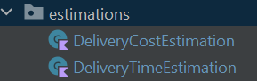

>### _DeliveryCostEstimation.kt_

_Returns the list of packages after estimating its delivery cost._

- **Methods**
  - _estimateDeliveryCost()_ - Calculates the total cost after negating the discount for each package and returns the list of all packages.
  - _calculateDiscount()_ - Calculates the discount for each package based on the offer code entered.

>### _DeliveryTimeEstimation.kt_

_Returns the list of packages after estimating its delivery time (and cost)._

- **Methods**
  - _estimateDeliveryTime()_ - Pre-processes the packages (fetching optimal package groups) and calculates their estimated delivery cost.
  - _calculateDeliveryTime()_ - Calculates the delivery time for each package according to the availability of the vehicle.

### \> com.twofaces.util

_Contains the utility classes._

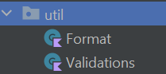

>### _Format.kt_

_Contains the formatting methods to format data._

- **Methods**
  - _formatString()_ - Format from decimal to integer if there are nothing but zeroes after the decimal point (XX.00 to XX).
  - _formatFloat()_ - Format the float value to display only 2 digits after the decimal point.

>### _Validations.kt_

_Contains the validation methods to validate data._

- **Methods**
  - _validateNegativeInt()_ - Validates the integers and throws exception in case of negative number.
  - _validateNegativeFloat()_ - Validates the float values and throws exception in case of negative number.
  - _validateStringEmpty()_ - Validates the strings and throws exception in case of empty string.

### Algorithm to calculate the optimal package group

> **Current algorithm**

We're taking subsets of all the possible solutions by backtracking and updating the package group that has the maximum number of packages with the heaviest total weight.

> **Optimization**

A variation of knapsack algorithm is being used to calculate the optimal package group.

[Click to check code](src/com/twofaces/misc/Optimization.kt)

### Unit tests

_Classes in **src.test.kotlin.com.twofaces** contains tests for all the major functionalities of the application_

> **What is tested?**

#### 1. Empty package list

&nbsp; 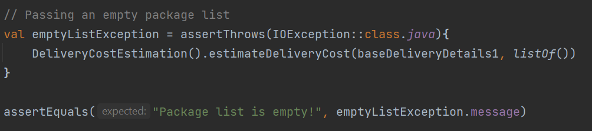

#### 2. Invalid distance or weight

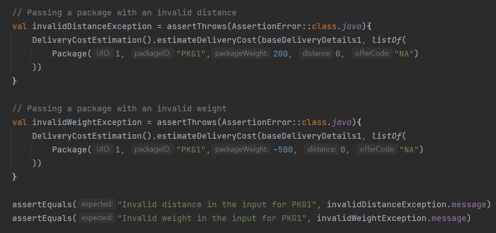

#### 3. Different aspects of user-inputted offer codes

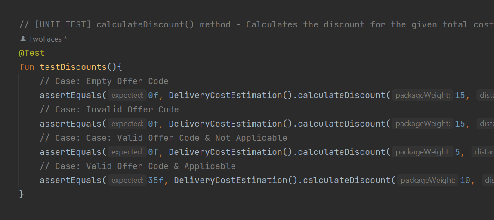

#### 4. Expected output 

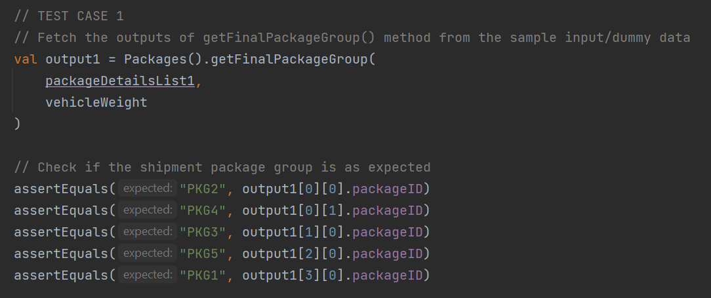

#### 5. Zero values & Negatives

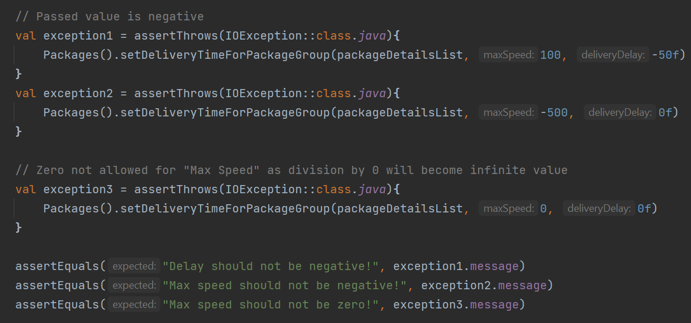

#### 6. Invalid formats

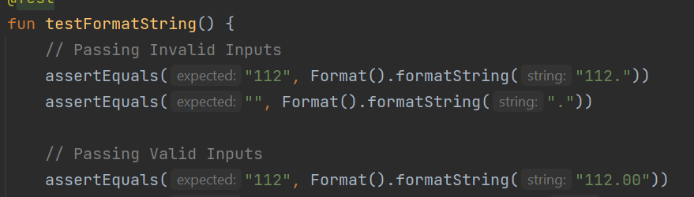

#### 7. Empty Strings

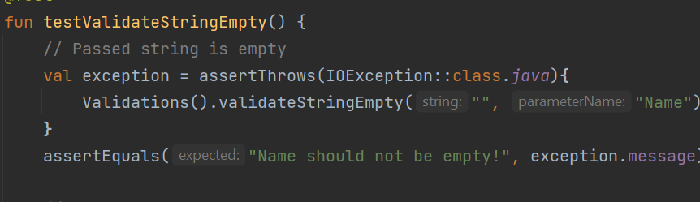

#### 8. \[CASE] - When multiple package group has same total weight, package group with the lowest distance is chosen

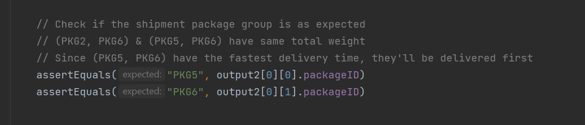

### How to start the application

> Application Entry Point

1. Run the `Main.kt` file located in the path `src/com/twofaces/Main.kt`

2. Choose one of the two features (1/2)

3. Enter the Input in the following format:

> Estimate Delivery Cost

    BASE_DELIVERY_COST NO_OF_PACKAGES
    PKG_ID_1 PKG_WEIGHT_1 PKG_DISTANCE_IN_KM_1 OFFER_CODE_1
    PKG_ID_2 PKG_WEIGHT_2 PKG_DISTANCE_IN_KM_2 OFFER_CODE_2
    .
    .
    .
    PKG_ID_N PKG_WEIGHT_N PKG_DISTANCE_IN_KM_N OFFER_CODE_N

> Estimate Delivery Time

    BASE_DELIVERY_COST NO_OF_PACKAGES
    PKG_ID_1 PKG_WEIGHT_1 PKG_DISTANCE_IN_KM_1 OFFER_CODE_1
    PKG_ID_2 PKG_WEIGHT_2 PKG_DISTANCE_IN_KM_2 OFFER_CODE_2
    .
    .
    .
    PKG_ID_N PKG_WEIGHT_N PKG_DISTANCE_IN_KM_N OFFER_CODE_N
    NO_OF_VEHICLES MAX_SPEED MAX_CARRIABLE_WEIGHT

For Example:

### Sample Test Cases

> Estimate Delivery Cost

    100 3
    PKG1 5 5 OFR001
    PKG2 15 5 OFR002
    PKG3 10 100 OFR003

> Estimate Delivery Time

    100 5
    PKG1 50 30 OFR001
    PKG2 75 125 OFFR0008
    PKG3 175 100 OFFR003
    PKG4 110 60 OFR002
    PKG5 155 95 NA
    2 70 200

I've made a function to generate these test cases randomly. You can check it out [here](https://github.com/devtwofaces/KikiCourier/blob/master/src/test/kotlin/com/twofaces/TestCaseGenerator.kt)

## Thank you very much for checking this project out. 

    
